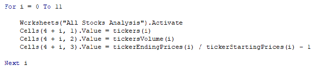

# stock-analysis

Overview of Project
We are analysis the behavior of a set of stocks (12 in total). In order to compare the returns between years 2017 and 2018 with the objective of present some picture of what path to chose when is time to invest in a specific finance vehicle.

## Results
We can see how the year 2017 had better returns when comparing against year 2018. For 2017 The analysis shows 11 Stocks out of 12 with a positive return between ~200% and 55%, and only one had a negative return of -7.21%. 

### 2017 vs 2018

---
### CODE

In order to get the prior analysis, we perform a VBA Macro when we defined the stocks to be analyzed and defined variables to determine volume, prices and as a result of prices we were able to determine the returns.

---

---

---
### Time Stamp

The execution times where shorter in the refactored script when comparing with the original script. We can see in the images below that for 2017 the original ran in 0.8007813 seconds while the refactored ran in 0.1679688 seconds. A similar situation is presented for the year 2018. The original ran in 7539063 seconds while the refactored ran in 0.1796875 seconds.

---

## Summary

1 The advantages of refactoring a code is that the code could be more efficiently more comprehensible and as a result more applicable in real situations when the doubt exist whether use a VBA code or simple putting together a bunch of formulas in excel without VBA.  
2 Regarding the original VBA script, when we refactored the code, it worked outside of a nested loop which avoid to go over and over to find the data from the set of Stocks, as a result it becomes quicker and efficiently. 
